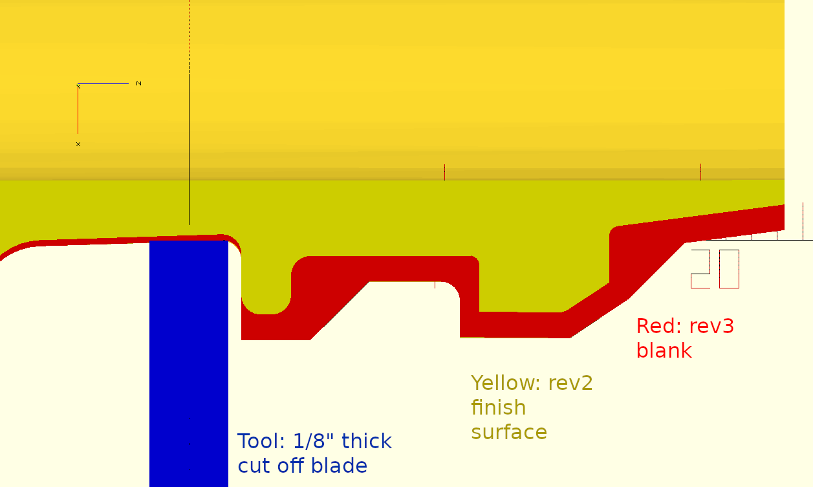

# Lathe Finished Version

This version includes extra 3D printed material on the 3M side, 
which is then machined off on a CNC lathe using the gcode in cleanup_operation_lathe.ngc.

The "_upright" version is designed to be 3D printed directly on the print
bed without additional support material--it has two tiny diagonal supports
around the Bullard "ears".

