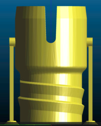
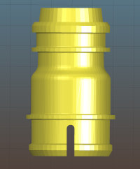

# PAPR-adapters

Positive Air Pressure Respirator (PAPR) devices pull air through a filter and push it into a mask over the user's head.  This produces much better protection against droplets than N95 masks or face shields.

A full PAPR system consists of multiple parts:
 * PAPR unit: battery, controller & sensors, air filter, and hose
 * PAPR hose: hose with an end port to connect to a hood
 * PAPR hoods with a hood port

PAPR systems are built to work with a set of components from a specific vendor model and is enforced through physical connector incompatibility between components like hood and hose. Different manufactures hoods and PAPRs units will not work together and even the same manufacture and different models are sometimes incompatible.

The PAPR-adapter project's goal is to provide adapters between different PAPR components to allow them to work together. This allows groups with multiple PAPR units and older/alternative PAPR hoods in their inventory the option of using hoods from one vendor on another vendor's PAPR. This is not typically allowed or considered best practice however in the context of COVID-19 the increased access to limited supply of in-hand PPE is more important.

> USE AT YOUR OWN RISK - THIS IS A STOP-GAP SOLUTION

The PAPR adapter project has helped solve the following adaption problems:

- **Bullard Mask to 3M Hose**:
  2008 era Bullard Hoods to 3M Versaflo PAPR hose

- **Bullard Hose replacement**: 
  Hose connector replacement for older Bullard PAPR units due to breakage of the connector.

- **3M Older BE Hood to Newer 3M Versaflo Hose**: 
  Adapt older BE-10 or BE-12 snap-in hood to newer BT-20, BT-30, or BT-40 type clip-on hose.

- **3M Hood port** - _coming soon_
- **Bullard hood port** - _coming soon_

# Bullard Mask to 3M Hose
This adapts the round 3M PAPR hose to the bayonet-style socket on the Bullard mask/hood.  It allows Bullard Masks to be used with 3M PAPR units.

Mask side: Bullard PAPR hood - port adapter style like Bullard PA30 units.

Hose side: 3M Versaflo PAPR hose
  3M part numbers: BT-20, BT-30, or BT-40 like used in 3M Versaflo TR-6710N.

# Bullard Hose Replacement
This connects the corrugated Bullard PAPR hose to the bayonet-style socket on the Bullard mask/hood.  It's a 3D printable replacement for the factory Bullard PAPR hose end.

Mask side: Bullard PAPR hood

Hose side: Bullard PAPR hose

# 3M "BE Type" Mask to 3M Clip-On Hose
This plugs into:

Mask side: Older 3M BE-12 or BE-10 snap-in type mask (normally used with unique 3M BE-224 hose).

Hose side: Newer 3M BT-20, BT-30, or BT-40 clip-on type hose.

# Sanitization and Safe Use
These parts were designed during the 2020 national COVID-19 crisis as emergency replacement parts to get PAPR units into service.  If you fabricate these parts, they MUST to be checked for material, strength, and dimensional compatibility with the PAPR machines used.  

3D printing can leave crevices that may not be reached by a wipe down, and almost no ordinary plastics can survive an autoclave, so we recommend full immersion sanitization.  NIH 2014 "Infection Prevention and Control of Epidemic- and Pandemic-Prone Acute Respiratory Infections in Health Care" Annex G lists ethanol at 70%, or bleach at 0.05% hypochlorite / 500ppm available chlorine (100 parts cold tap water to 1 part household 5% bleach) for at least 30 minutes.  The bleach solution will need to be rinsed off with water afterwards, or it will leave salt spots.

The UAF Engineering machine shop has tooling to create a strong smooth machined Delrin version of the Bullard Mask to 3M Hose adapter.  Contact uaf-oipc@alaska.edu for pricing and availability.

3M Versaflo and Bullard are trademarks of their respective companies.  These files were developed with support from the University of Alaska Fairbanks Center for Intellectual Property, Commercialization, and Entrepreneurship, including funding from the Office of Naval Research.

# Credits

The PAPR adapters were put together by a team of researchers and engineers at the University of Alaska Fairbanks with funding support from the Office of Naval Research.

* Benjamin Loeffler <bhloeffler@alaska.edu> - Model designer
* Orion Lawlor <oslawlor@alaska.edu> - 3d Printing lead
* Eric Johansen <lejohansen@alaska.edu> - CNC coding for durable/reusable parts
* Dayne Broderson <dbbroderson@alaska.edu> - User interfacing and design requirements
* Greg Shipman <gkshipman@alaska.edu> - 3D printing & consulting
