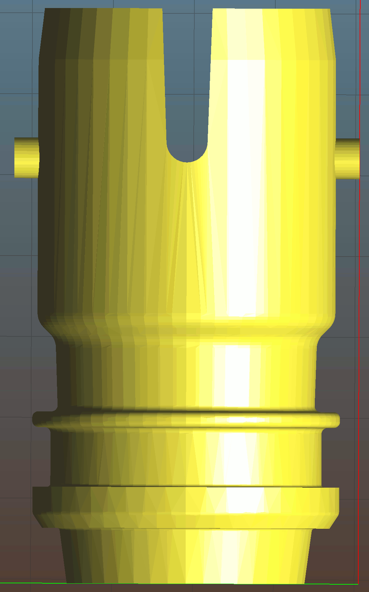

# PAPR-adapters

Positive Air Pressure Respirator (PAPR) devices pull air through a filter and push it into a mask over the user's head.  This produces much better protection against droplets than N95 masks or face shields.

# Bullard Mask to 3M Hose
This adapts the round 3M PAPR hose to the bayonet-style socket on the Bullard mask/hood.  It allows Bullard Masks to be used with 3M PAPR units.

Mask side: Bullard PAPR hood

Hose side: 3M Versaflo PAPR hose (3M part numbers BT-20, BT-30, or BT-40) 

# Bullard Hose Replacement
This connects the corrugated Bullard PAPR hose to the bayonet-style socket on the Bullard mask/hood.  It's a 3D printable replacement for the factory Bullard PAPR hose end.

Mask side: Bullard PAPR hood

Hose side: Bullard PAPR hose

# Sanitization and Safe Use
These parts were designed during the 2020 national COVID-19 crisis as emergency replacement parts to get PAPR units into service.  If you fabricate these parts, they MUST to be checked for material, strength, and dimensional compatibility with the PAPR machines used.  

3D printing can leave crevices that may not be reached by a wipe down, and almost no ordinary plastics can survive an autoclave, so we recommend full immersion sanitization.  NIH 2014 "Infection Prevention and Control of Epidemic- and Pandemic-Prone Acute Respiratory Infections in Health Care" Annex G lists ethanol at 70%, or bleach at 0.05% hypochlorite / 500ppm available chlorine (100 parts cold tap water to 1 part household 5% bleach) for at least 30 minutes.  The bleach solution will need to be rinsed off with water afterwards, or it will leave salt spots.

The UAF Engineering machine shop has tooling to create a strong smooth machined Delrin version of the Bullard Mask to 3M Hose adapter.  Contact Eric Johansen <lejohansen@alaska.edu> for pricing and availability.

3M Versaflo and Bullard are trademarks of their respective companies.  These files were developed with support from the University of Alaska Fairbanks Center for Intellectual Property, Commericalization, and Entrepreneurship, including funding from the Office of Naval Research. 

